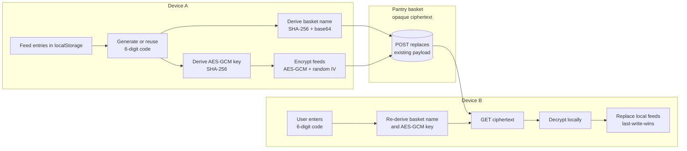

This is a [Next.js](https://nextjs.org) project bootstrapped with [`create-next-app`](https://nextjs.org/docs/app/api-reference/cli/create-next-app).

## Getting Started

First, run the development server:

```bash
npm run dev
# or
yarn dev
# or
pnpm dev
# or
bun dev
```

Open [http://localhost:3000](http://localhost:3000) with your browser to see the result.

You can start editing the page by modifying `app/page.tsx`. The page auto-updates as you edit the file.

This project uses [`next/font`](https://nextjs.org/docs/app/building-your-application/optimizing/fonts) to automatically optimize and load [Geist](https://vercel.com/font), a new font family for Vercel.

## Learn More

To learn more about Next.js, take a look at the following resources:

- [Next.js Documentation](https://nextjs.org/docs) - learn about Next.js features and API.
- [Learn Next.js](https://nextjs.org/learn) - an interactive Next.js tutorial.

You can check out [the Next.js GitHub repository](https://github.com/vercel/next.js) - your feedback and contributions are welcome!

## Deploy on Vercel

The easiest way to deploy your Next.js app is to use the [Vercel Platform](https://vercel.com/new?utm_medium=default-template&filter=next.js&utm_source=create-next-app&utm_campaign=create-next-app-readme) from the creators of Next.js.

Check out our [Next.js deployment documentation](https://nextjs.org/docs/app/building-your-application/deploying) for more details.

## Cross-Device Sync

CupApi stores feed logs in the browser's `localStorage` by default. The optional **Save log** feature lets a user push that history to a shared cloud store and pull it back on any other device using a 6-digit code — no account, no backend, no database to maintain.

### Setup

1. Create a free pantry at [getpantry.cloud](https://getpantry.cloud) (only an email is required) and copy the Pantry ID.
2. Duplicate `.env.local.example` as `.env.local` and set:
   ```
   NEXT_PUBLIC_PANTRY_ID=your-pantry-id-here
   ```
3. Restart `pnpm dev`. The **Buka sinkronisasi** action appears under the tracker's settings panel.

Without the env var, the sync sheet shows a setup hint instead of crashing.

### How it works

The 6-digit code never leaves the user's devices. It is used purely to derive two values in the browser:

- **Basket name** — `cupapi-` + first 24 chars of `base64(sha256("cupapi:basket:" + code))`. This is the lookup key on Pantry. The original digits are not present in the URL.
- **Encryption key** — `sha256("cupapi:key:" + code)` is imported as a 256-bit AES-GCM key.

The feed list is encrypted with that key (random 96-bit IV per write) before any network call, so the Pantry basket only ever contains opaque ciphertext.



### Save vs. Load semantics

| Action      | HTTP            | Effect on the basket                                | Effect on local feeds        |
| ----------- | --------------- | --------------------------------------------------- | ---------------------------- |
| Simpan log  | `POST` to Pantry | Fully overwrites the basket with the current device | Unchanged                    |
| Muat log    | `GET` from Pantry | Unchanged                                           | Fully replaced with remote   |

Last-write-wins is applied at the document level: whichever device pressed _Simpan log_ most recently is the version the next device will see when it presses _Muat log_.

### Payload shape

The encrypted JSON document stored in a Pantry basket looks like:

```json
{
  "v": 1,
  "updatedAt": "2026-06-02T03:14:15.926Z",
  "iv": "base64(12 random bytes)",
  "ciphertext": "base64(AES-GCM(JSON.stringify({ feeds: [...] })))"
}
```

Only `feeds` are synced — settings (baby name, interval, grace) stay on each device.

### Security notes

- The 6-digit code is the only secret. Treat it carefully: whoever holds both the Pantry ID and the code can read or overwrite the log.
- The Pantry account owner cannot read feeds — the server only sees ciphertext.
- A 6-digit code has 1,000,000 possible values; if you expect many users, prefer rotating codes after each load. For a personal tracker the collision and brute-force risk is negligible because Pantry rate-limits aggressive callers.
- The sync code itself is cached in `localStorage` under `cupapi:sync-code` so the user does not have to retype it. Clear browser data to remove it.

### Related files

- [`lib/sync.ts`](lib/sync.ts) — encryption helpers, code generation, Pantry client.
- [`app/tracker.tsx`](app/tracker.tsx) — `SyncSheet` UI and the wiring into the tracker state.
- [`.env.local.example`](.env.local.example) — environment template.
